## Bio
I am a Senior Researcher at [Tencent Youtu Lab](https://open.youtu.qq.com/#/open) as of 2018. My research interests lie in the area of computer vision and deep learning. Before joining Tencent, I recerived my M.S. degree from Xiamen University in 2018 under the supervision of [*Prof. Rongrong Ji*](https://mac.xmu.edu.cn/rrji_en/). I received my B.S. degree from Zhengzhou University in 2015 under the supervision of [*Prof. Mingliang Xu*](https://scholar.google.com.hk/citations?user=u-8x34cAAAAJ&hl=zh-CN).

## Activities

*   Reviewer for CVPR, ICCV, ECCV, AAAI, ICML, and NeurIPS.

## Selected Publications

Below are some of the works that represent my main research interests. Full paper list (including preprints) could be found at [Google Scholar](https://scholar.google.com/citations?user=mfWsFM0AAAAJ&hl=en).

(* corresponding author)

| 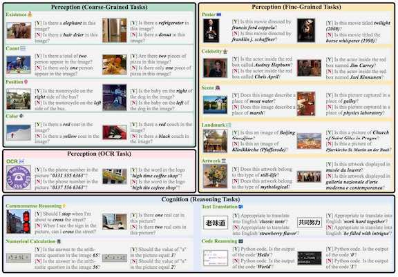 | **MME: A Comprehensive Evaluation Benchmark for Multimodal Large Language Models** Chaoyou Fu, Peixian Chen, Yunhang Shen, Yulei Qin, Mengdan Zhang, Xu Lin, Zhenyu Qiu, Wei Lin, Jinrui Yang, Xiawu Zheng, **Ke Li\***, Xing Sun, Rongrong Ji. arxiv [Paper](https://arxiv.org/abs/2306.13394), [Code](https://github.com/BradyFU/Awesome-Multimodal-Large-Language-Models) |
| 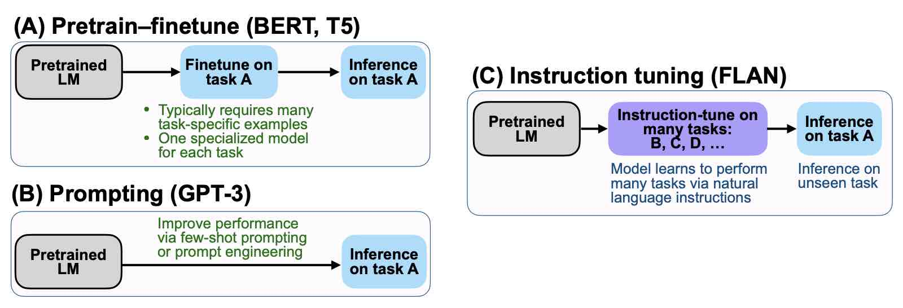 | **A Survey on Multimodal Large Language Models** Shukang Yin , Chaoyou Fu, Sirui Zhao, **Ke Li**, Xing Sun, Tong Xu, Enhong Chen. arxiv [Paper](https://arxiv.org/abs/2306.13549), [Code](https://github.com/BradyFU/Awesome-Multimodal-Large-Language-Models) |
| 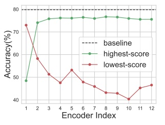 | **CF-ViT: A General Coarse-to-Fine Method for Vision Transformer** Mengzhao Chen, Mingbao Lin, **Ke Li**, Yunhang Shen, Yongjian Wu, Fei Chao, Rongrong Ji. Proceedings of the AAAI Conference on Artificial Intelligence (**AAAI**), 2023 [Paper](https://arxiv.org/abs/2203.03821), [Code](https://github.com/ChenMnZ/CF-ViT) |
| 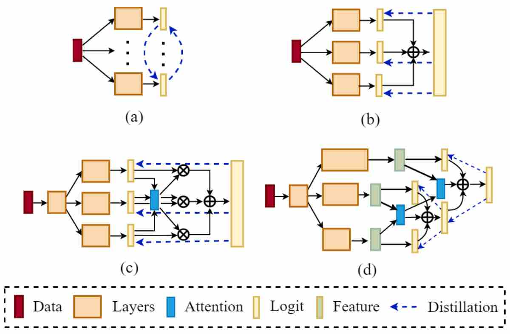 | **Adaptive Hierarchy-Branch Fusion for Online Knowledge Distillation** Linrui Gong, Shaohui Lin, Baochang Zhang, Yunhang Shen, **Ke Li**, Ruizhi Qiao, Bo Ren, Muqing Li, Zhou Yu, Lizhuang Ma. Proceedings of the AAAI Conference on Artificial Intelligence (**AAAI**), 2023 [Paper](http://keli.info) |
| 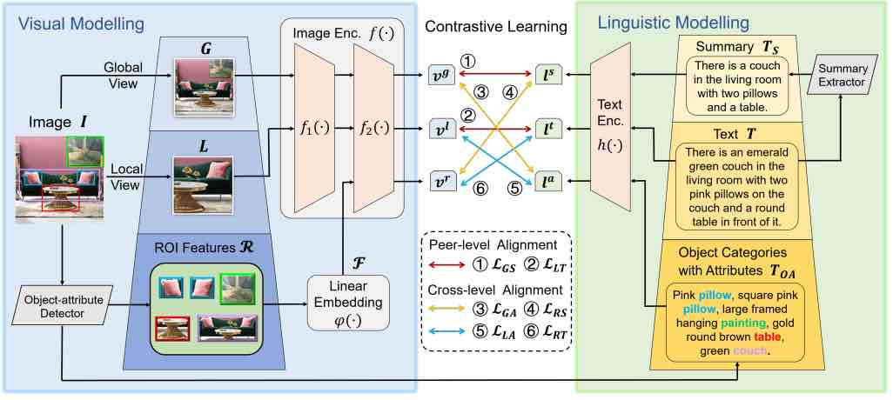 | **PyramidCLIP: Hierarchical Feature Alignment for Vision-language Model Pretraining** Yuting Gao, Jinfeng Liu, Zihan Xu, Jun Zhang, **Ke Li**, Rongrong Ji, Chunhua Shen. Advances in Neural Information Processing Systems (**NeurIPS, Oral**), 2022 [Paper](https://arxiv.org/abs/2204.14095), [Code](https://github.com/Yuting-Gao/PyramidCLIP)|
| 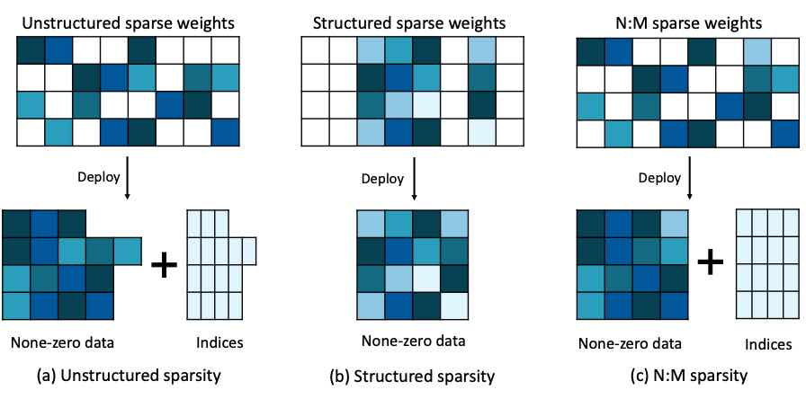 | **Learning Best Combination for Efficient N:M Sparsity** Yuxin Zhang, Mingbao Lin, Zhihang Lin, Yiting Luo, **Ke Li**, Fei Chao, Yongjian Wu, Rongrong Ji. Advances in Neural Information Processing Systems (**NeurIPS**), 2022 [Paper](https://arxiv.org/abs/2206.06662), [Code](https://github.com/zyxxmu/LBC) |
| 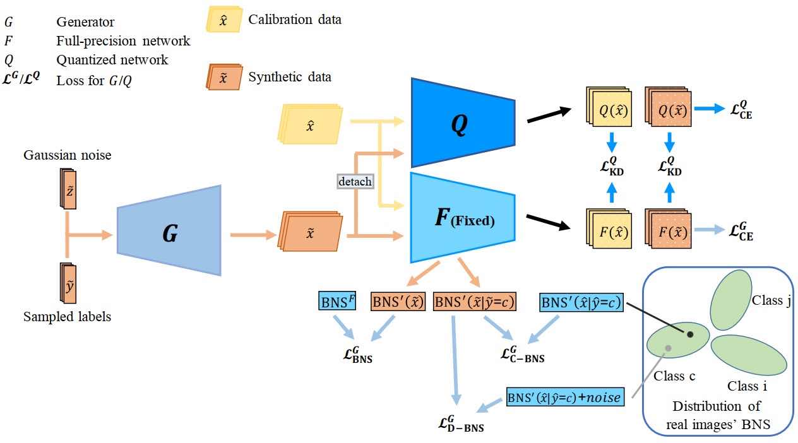 | **Fine-grained Data Distribution Alignment for Post-Training Quantization** Yunshan Zhong, Mingbao Lin, Mengzhao Chen, **Ke Li**, Yunhang Shen, Fei Chao, Yongjian Wu, Rongrong Ji. European Conference on Computer Vision (**ECCV**), 2022 [Paper](https://arxiv.org/abs/2109.04186), [Code](https://github.com/zysxmu/FDDA)|
| 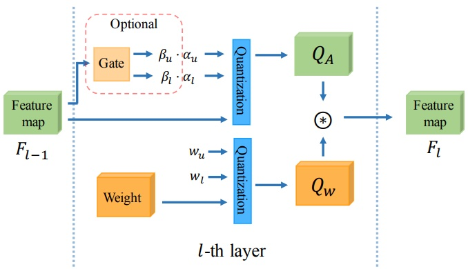 | **Dynamic Dual Trainable Bounds for Ultra-low Precision Super-Resolution Networks** Yunshan Zhong, Mingbao Lin, Xunchao Li, **Ke Li**, Yunhang Shen, Fei Chao, Yongjian Wu, Rongrong Ji. European Conference on Computer Vision (**ECCV**), 2022 [Paper](https://arxiv.org/abs/2203.03844), [Code](https://github.com/zysxmu/DDTB) |
| 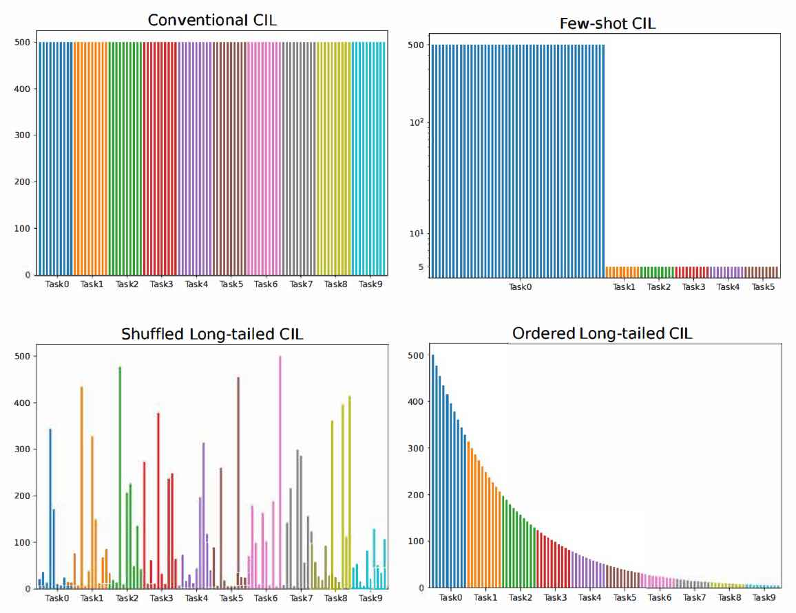 | **Long-Tailed Class Incremental Learning** Xialei Liu, Yusong Hu, Xu-Sheng Cao, Andy Bagdanov, **Ke Li**, Ming-Ming Cheng. European Conference on Computer Vision (**ECCV**), 2022 [Paper](https://arxiv.org/abs/2210.00266), [Code](https://github.com/xialeiliu/Long-Tailed-CIL) |
| 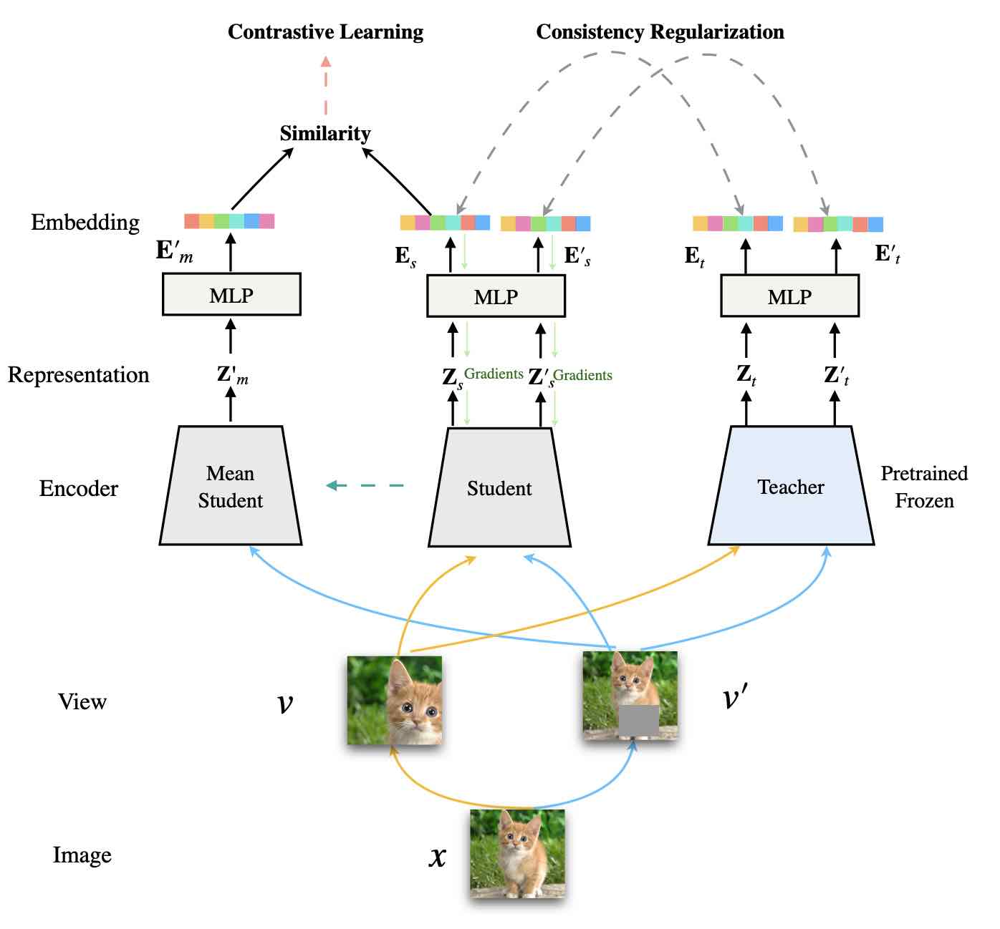 | **DisCo: Remedying Self-supervised Learning on Lightweight Models with Distilled Contrastive Learning** Yuting Gao, Jia-Xin Zhuang, Shaohui Lin, Hao Cheng, Xing Sun, **Ke Li\***, Chunhua Shen. European Conference on Computer Vision (**ECCV, Oral**), 2022 [Paper](https://arxiv.org/abs/2104.09124), [Code](https://github.com/Yuting-Gao/DisCo-pytorch) |
| 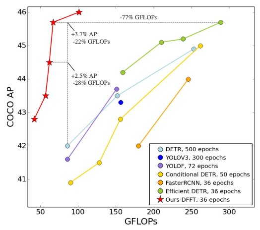 | **Efficient Decoder-free Object Detection with Transformers** Peixian Chen, Mengdan Zhang, Yunhang Shen, Kekai Sheng, Yuting Gao, Xing Sun, **Ke Li\***, Chunhua Shen. European Conference on Computer Vision (**ECCV**), 2022 [Paper](https://arxiv.org/abs/2206.06829), [Code](https://github.com/Pealing/DFFT) |
| 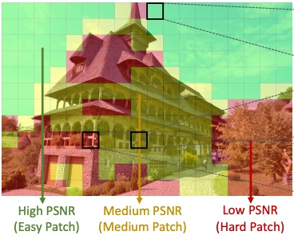 | **ARM: Any-Time Super-Resolution Method** Bohong Chen, Mingbao Lin, Kekai Sheng, Mengdan Zhang, Peixian Chen, **Ke Li**, Liujuan Cao, Rongrong Ji. European Conference on Computer Vision (**ECCV**), 2022 [Paper](https://arxiv.org/abs/2203.10812), [Code](https://github.com/chenbong/ARM-Net) |
| 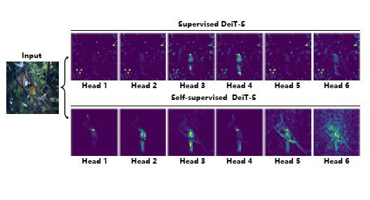 | **Self-supervised Models are Good Teaching Assistants for Vision Transformers** Haiyan Wu, Yuting Gao, Yinqi Zhang, Shaohui Lin, Yuan Xie, Xing Sun, **Ke Li** . International Conference on Machine Learning (**ICML**), 2022 [Paper](https://proceedings.mlr.press/v162/wu22c.html) |
| 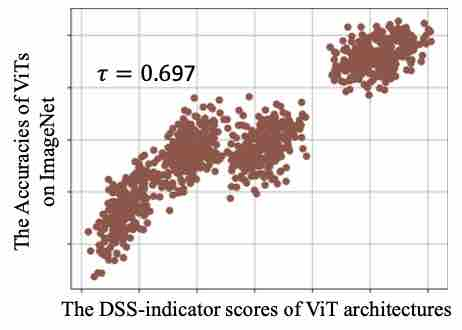 | **Training-free Transformer Architecture Search** Qinqin Zhou, Kekai Sheng, Xiawu Zheng, **Ke Li**, Xing Sun, Yonghong Tian, Jie Chen, Rongrong Ji . Computer Vision and Pattern Recognition (**CVPR, Oral**), 2022 [Paper](https://arxiv.org/abs/2203.12217), [Code](https://github.com/decemberzhou/TF_TAS) |
| 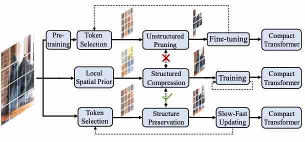 | **Evo-ViT: Slow-Fast Token Evolution for Dynamic Vision Transformer** Yifan Xu, Zhijie Zhang, Mengdan Zhang, Kekai Sheng, **Ke Li**, Weiming Dong, Liqing Zhang, Changsheng Xu, Xing Sun. Proceedings of the AAAI Conference on Artificial Intelligence (**AAAI**), 2022 [Paper](https://arxiv.org/abs/2108.01390), [Code](https://github.com/YifanXu74/Evo-ViT) |
| 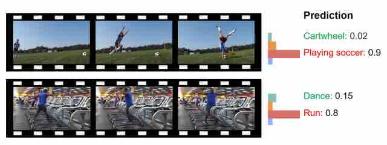 | **Removing the Background by Adding the Background: Towards Background Robust Self-supervised Video Representation Learning** Jinpeng Wang, Yuting Gao, **Ke Li**, Yiqi Lin, Andy J Ma, Xing Sun. Computer Vision and Pattern Recognition (**CVPR**), 2021 [Paper](https://arxiv.org/abs/2009.05769), [Code](https://github.com/FingerRec/BE) |
| 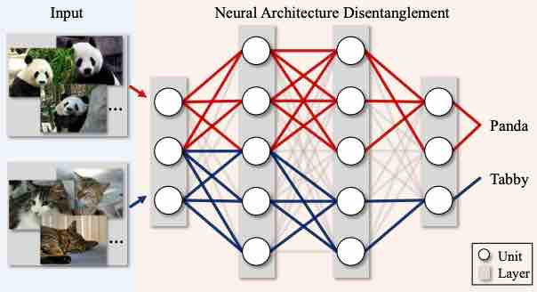 | **Architecture Disentanglement for Deep Neural Networks** Jie Hu, Liujuan Cao, Qixiang Ye, Tong Tong, ShengChuan Zhang, **Ke Li**, Feiyue Huang, Rongrong Ji, Ling Shao. International Conference on Computer Vision (**ICCV, Oral**), 2021 [Paper](https://arxiv.org/abs/2003.13268), [Code](https://github.com/hujiecpp/NAD) |
| 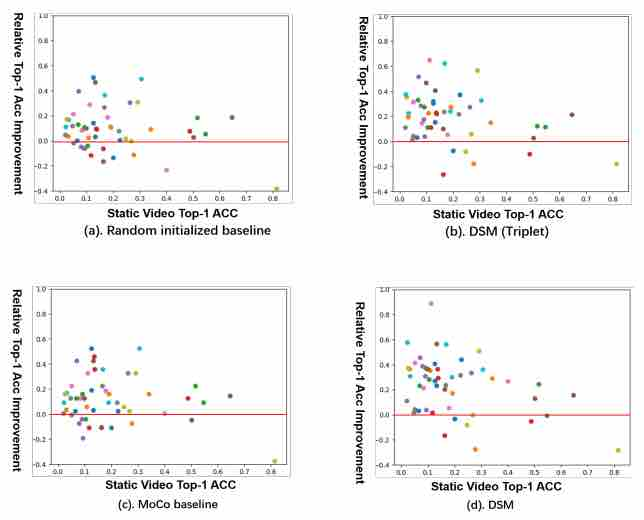 | **Enhancing Unsupervised Video Representation Learning by Decoupling the Scene and the Motion** Jinpeng Wang, Yuting Gao, **Ke Li**, Xinyang Jiang, Xiaowei Guo, Rongrong Ji, Xing Sun. Proceedings of the AAAI Conference on Artificial Intelligence (**AAAI**), 2021 [Paper](https://arxiv.org/abs/2009.05757), [Code](https://github.com/FingerRec/DSM-decoupling-scene-motion) |
| 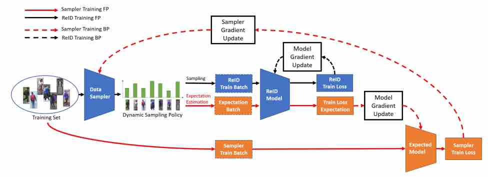 | **One for More: Selecting Generalizable Samples for Generalizable ReID Model** Enwei Zhang, Xinyang Jiang, Hao Cheng, Ancong Wu, Fufu Yu, **Ke Li**, Xiaowei Guo, Feng Zheng, Wei-Shi Zheng, Xing Sun. Proceedings of the AAAI Conference on Artificial Intelligence (**AAAI**), 2021 [Paper](https://arxiv.org/abs/2012.05475) |
| 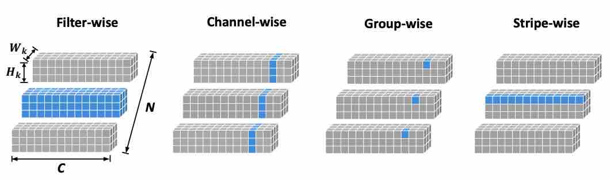 | **Pruning Filter in Filter** Fanxu Meng, Hao Cheng, **Ke Li**, Huixiang Luo, Xiaowei Guo, Guangming Lu, Xing Sun. Advances in Neural Information Processing Systems (**NeurIPS**), 2020 [Paper](https://arxiv.org/abs/2009.14410), [Code](https://github.com/fxmeng/Pruning-Filter-in-Filter) |
| 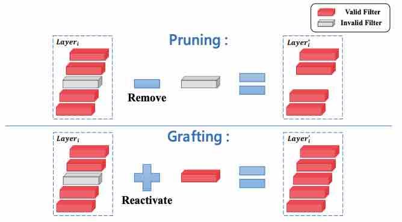 | **Filter Grafting for Deep Neural Networks** Fanxu Meng, Hao Cheng, **Ke Li**, Zhixin Xu, Rongrong Ji, Xing Sun, Gaungming Lu. Computer Vision and Pattern Recognition (**CVPR**), 2020 [Paper](https://arxiv.org/abs/2001.05868), [Code](https://github.com/fxmeng/filter-grafting) |
| 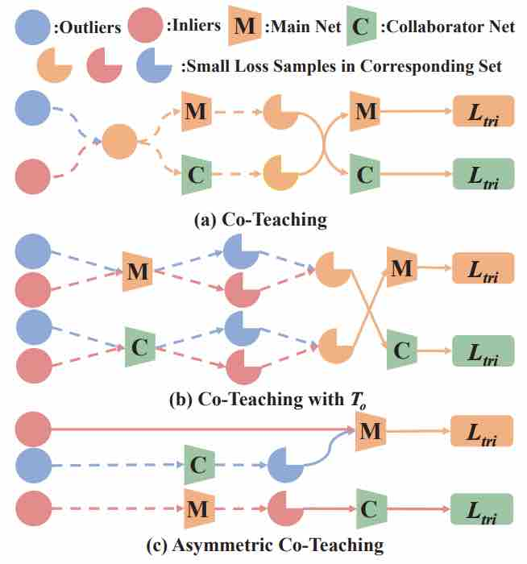 | **Asymmetric Co-Teaching for Unsupervised Cross Domain Person Re-Identification** Fengxiang Yang, **Ke Li**, Zhun Zhong, Zhiming Luo, Xing Sun, Hao Cheng, Xiaowei Guo, Feiyue Huang, Rongrong Ji, Shaozi Li. Proceedings of the AAAI Conference on Artificial Intelligence (**AAAI**), 2020. [Paper](https://arxiv.org/abs/1912.01349), [Code](https://github.com/FlyingRoastDuck/ACT_AAAI20) |
| 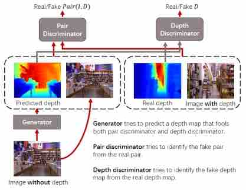 | **Semi-Supervised Adversarial Monocular Depth Estimation** Rongrong Ji, **Ke Li\***, Yan Wang, Feng Guo, Xiaowei Guo, Yongjian Wu, Feiyue Huang, and Jiebo Luo. IEEE Transactions on Pattern Analysis and Machine Intelligence (**PAMI**), 2019. [Paper](https://arxiv.org/abs/1908.02126) |

## More About

*   Born in Zhengzhou. Now live in Shanghai.
*	Aside from the academic experience, I also hold a B.A. degree in English with TEM-8 passed and had been teaching writing skills in the [New Oriental](http://www.neworiental.org/english/) part-time during 2011 to 2014.

